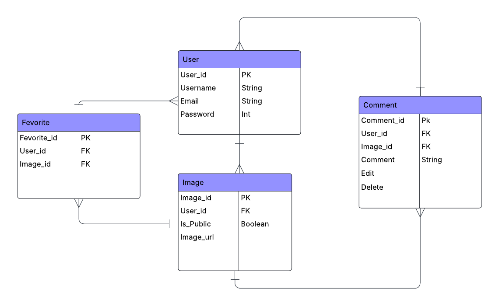

# AI Image Generator - Frontend

This is the backend for the Image Generation web app, built using **Django**. Users can register, log in, generate images from text prompts, favorite them, make them public, and comment using emojis.

---

## ⭐ Tech Stack

- **Django**
- **Django REST Framework**
- **PostgreSQL**
- **JWT Authentication**
- **Docker / Docker Compose**

---
## ⭐ ERD Diagram


---
## ⭐ Routing Table

| Method | Endpoint                          | Description                      |
|--------|-----------------------------------|----------------------------------|
| POST   | /users/signup/                    | Register a new user              | 
| POST   | /users/login/                     | Log in and get tokens            | 
| POST   | /users/token/refresh/             | Refresh JWT token                |
| GET    | /images/explore/                  | List all public images           |
| POST   | /images/                          | Generate a new image             |
| PUT    | /images/:id/publish/              | Make image public                |
| POST   | /images/:id/favorite/             | Toggle favorite                  |
| GET    | /images/favorites/                | List user's favorites            |
| DELETE | /images/favorites/:id/            | Remove favorite                  |
| POST   | /images/:id/comments/             | Add emoji comment                |

---
## ⭐ IceBox Features (Future Ideas)

- Integration with Stable Diffusion or Hugging Face models directly

---
## ⭐ Installation (Docker)

```bash
# Clone the repo
git clone https://github.com/Rubabdran/Backend.git
cd backend

# Build & run with Docker Compose
docker-compose up --build
```
## 🔗 Links

- **Frontend Repository**: [View Frontend Repo](https://github.com/Rubabdran/Frontend)
- **Deploy**: (http://localhost:8000)
